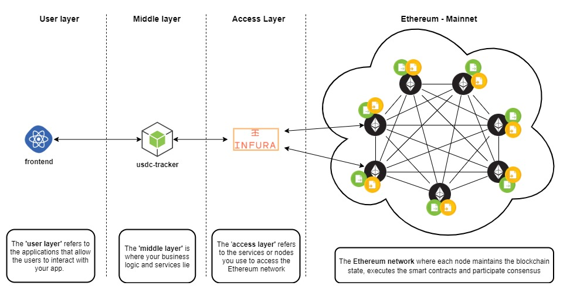

# USDC Tracker

A simple NodeJS application to track USD Coin exchanges over the Ethereum Blockchain. 



The application outputs a log that contains the transaction details each time USDC are exchanged in the world. Here is an example of such a log (worth 190.00$) :

```
{
  removed: false,
  logIndex: 38,
  transactionIndex: 44,
  transactionHash: '0x5905f197e2e74ec3a088008f1814829ce3da693b60fb60906c8b092db47b00fe',
  blockHash: '0x52b571f6a48ab3942faf0a190bf21bc45ed80ab8baf5aa9e53f209bfd12775e4',
  blockNumber: 9885095,
  address: '0xA0b86991c6218b36c1d19D4a2e9Eb0cE3606eB48',
  id: 'log_8b0a0e0b',
  returnValues: Result {
    '0': '0xA910f92ACdAf488fa6eF02174fb86208Ad7722ba',
    '1': '0xCB98225fe431824fA93DbC9A8A874F22D6DF01b4',
    '2': '190000000',
    from: '0xA910f92ACdAf488fa6eF02174fb86208Ad7722ba',
    to: '0xCB98225fe431824fA93DbC9A8A874F22D6DF01b4',
    value: '190000000'
  },
  event: 'Transfer',
  signature: '0xddf252ad1be2c89b69c2b068fc378daa952ba7f163c4a11628f55a4df523b3ef',
  raw: {
    data: '0x000000000000000000000000000000000000000000000000000000000b532b80',
    topics: [
      '0xddf252ad1be2c89b69c2b068fc378daa952ba7f163c4a11628f55a4df523b3ef',
      '0x000000000000000000000000a910f92acdaf488fa6ef02174fb86208ad7722ba',
      '0x000000000000000000000000cb98225fe431824fa93dbc9a8a874f22d6df01b4'
    ]
  }
}
```

### Prerequisites

This NodeJS application uses Infura to connect to the Ethereum main net. 

- npm
- A free Infura Account
- A free Infura API Key

### Run the application

After cloning the repository, restore the packages using

```
npm install
```

Then, create a file named ".env" in the same directory as usdc-tracker. This file must contain the definition of the INFURA_PROJECT_ID env. variable. Replace accordingly :

.env file content :

```
INFURA_PROJECT_ID=<YOUR_INFURA_PROJECT_ID>
```

You can run the application using

```
node usdc-tracker.js
```

### What is the USD Coin ?

USD Coin (USDC) is a stablecoin backed by US dollars, which are held in reserve by regulated financial institutions.

### Some explanation

The USD Coin is a ERC20 Token that run on top of the Ethereum Blockchain. The ERC20 defines a standard interface to manage fungible tokens with an event called Transfer that should be fired each time the token is transfered between two parties.

The USDC smart contract is located at the address 0xA0b86991c6218b36c1d19D4a2e9Eb0cE3606eB48. The smart contract uses the OpenZeppelin unstructured storage proxy pattern to forward calls to a 'Logic' contract that contains the real implementation. This 'Logic' contract is based on the OpenZeppelin ERC20  implementation located at the address 0x0882477e7895bdc5cea7cb1552ed914ab157fe56. 

Therefore, to interact with the USDC smart contract with Web3js, you need to get the ABI of the 'Logic' contract (0x0882477e7895bdc5cea7cb1552ed914ab157fe56) and use the 'Proxy' contract address (0xA0b86991c6218b36c1d19D4a2e9Eb0cE3606eB48). The USDC Smart Contract will forward calls to the implementing contract.

[More on the OpenZeppelin proxy pattern here](https://blog.openzeppelin.com/proxy-patterns/)